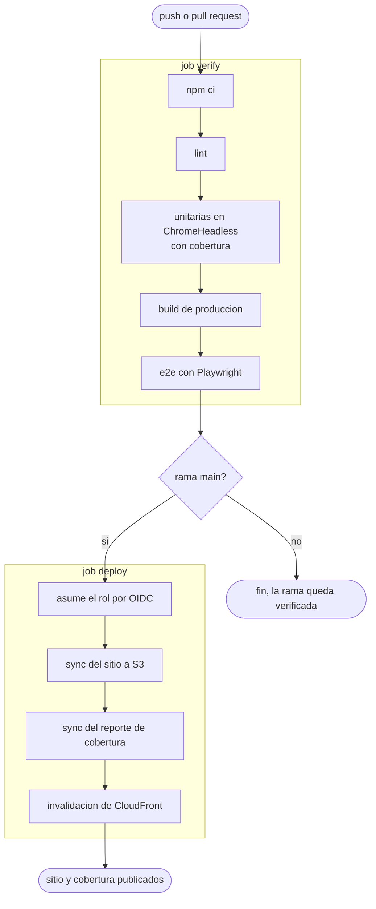

# Sismos M4.5+, visor geográfico interactivo

[](https://github.com/dfquicazanr/realtix-tech-test/actions/workflows/ci.yml)
[](https://d2xljcyv699q75.cloudfront.net/coverage/index.html)

SPA en Angular 20 y MapLibre GL que muestra los sismos de magnitud 4.5 o mayor de los últimos
30 días, tomados del feed público de USGS. El mapa y el listado leen del mismo estado, así que
lo que se ve en uno siempre coincide con lo que se ve en el otro.

**Desplegado en https://d2xljcyv699q75.cloudfront.net**

- Fuente de datos: `https://earthquake.usgs.gov/earthquakes/feed/v1.0/summary/4.5_month.geojson`
- Mapa base: `https://demotiles.maplibre.org/style.json` (sin API key)

## Correrlo en local

```bash
npm install
npm start
```

Queda en `http://localhost:4200`. No hay backend, ni variables de entorno, ni pasos ocultos:
el feed de USGS sirve CORS y se consume directo desde el navegador.

## Qué hace

1. **Mapa.** Capa de puntos de MapLibre alimentada con el GeoJSON. El radio y el color dependen
   de la magnitud.
2. **Listado.** Panel lateral con una tarjeta por sismo: magnitud, lugar y fecha.
3. **Interactividad en las dos direcciones.**
   - Clic en un punto del mapa: se abre el panel de detalle con las propiedades completas del
     sismo y se resalta su tarjeta en la lista.
   - Clic en una tarjeta: el mapa hace `flyTo` hasta las coordenadas del sismo.
   - Hover sobre una tarjeta: el punto correspondiente cambia de color y tamaño en el mapa, y
     al revés.
4. **Filtros.** Rango de magnitud y rango de fechas dentro de los últimos 30 días, aplicados a
   la vez sobre el mapa y sobre el listado.

## Decisiones de arquitectura

**Angular 20 con componentes standalone y signals, sin store externo.** El estado de esta app
son cinco signals. Un store externo no aportaría nada aquí y añadiría ceremonia.

**Un solo filtrado, en TypeScript.** La tentación es filtrar el mapa con una expresión `filter`
de MapLibre y la lista con un filtro de arreglo aparte. Eso se desincroniza. Aquí el filtrado
ocurre una vez, en `visible()`, y ese mismo arreglo alimenta el `@for` de la lista y el
`source.setData()` del mapa. No es que estén sincronizados: es que son el mismo dato.

**Una sola fuente para la selección.** Tanto el clic en el mapa como el clic en la tarjeta
escriben `selectedId` en el store. El mapa y la lista leen de ahí, y ninguno de los dos le da
órdenes al otro. El `flyTo` se dispara desde un efecto sobre la selección, no desde el handler
del clic, que es lo que evita el ciclo de actualizaciones.

**MapLibre directo, sin wrapper.** El hover se resuelve con `setFeatureState`, que necesita ids
de feature estables. Cada sismo recibe un `quakeId` numérico en el momento de la carga (no
derivado del arreglo filtrado, que cambia con cada filtro) y el source lo declara con
`promoteId`. Así el hover repinta los círculos afectados en vez de reconstruir la capa en cada
movimiento del puntero. Los wrappers de Angular sobre MapLibre estorban justamente para esto.

**El worker de MapLibre se sirve como asset.** maplibre-gl carga su worker de teselas como un
módulo aparte que ni el dev server ni el bundle de producción emiten, así que se copia a
`maplibre/` desde `angular.json` y se apunta ahí con `setWorkerUrl` en `main.ts`. Sin eso el
mapa nunca termina de inicializar y queda en blanco.

**Tailwind** para estilos, sin sistema de diseño propio.

## Pruebas

```bash
npm run test:ci   # unitarias, Karma y Jasmine, ChromeHeadless
npm run e2e       # end to end, Playwright
```

Karma reutiliza el Chrome que Playwright descarga (`npx playwright install chromium`), así que
las dos suites corren sobre el mismo navegador en local y en CI.

Las unitarias cubren lo que tiene lógica de verdad: la función de filtrado (límites de magnitud
y de fecha inclusivos, rango vacío, rango invertido, rango completo), el parseo del GeoJSON
(features sin magnitud, sin geometría, sin fecha o sin id se descartan en vez de tumbar la app)
y el store, donde se ve que un solo `visible()` responde a los dos filtros.

Los e2e son tres, uno por comportamiento observable: la app carga y pinta los puntos, el clic en
una tarjeta mueve el mapa y abre el detalle, y mover un filtro reduce la lista y el mapa a la
vez. Ese último es el que demuestra que los filtros están sincronizados. El feed se sirve desde
un fixture para poder afirmar conteos exactos sin depender de qué esté temblando hoy.

Para que los e2e puedan comprobar el estado del mapa sin entrar al canvas de WebGL, el
contenedor del mapa expone cuántos features tiene y dónde está centrado en dos data attributes.

### Cobertura

`npm run test:ci` la genera con Istanbul. CI la publica junto con el sitio, así que el reporte
navegable, con el detalle línea por línea, está en
**https://d2xljcyv699q75.cloudfront.net/coverage/index.html** y también queda como artefacto de
cada corrida en Actions.

| Archivo | Sentencias | Ramas | Funciones | Líneas |
| --- | --- | --- | --- | --- |
| `core/filter.ts` | 100% | 100% | 100% | 100% |
| `core/quakes.store.ts` | 91.9% | 66.7% | 75% | 96.8% |
| `core/usgs.service.ts` | 84.8% | 90.3% | 75% | 85.2% |
| **Total** | **89.3%** | **87.8%** | **77.8%** | **92.1%** |

Son los tres archivos que tienen lógica. Los componentes no aparecen aquí a propósito: lo que
hay que probar en ellos es que el clic mueva el mapa y que el filtro recorte las dos vistas a la
vez, y eso lo cubren los e2e, que ejercitan el navegador de verdad. Perseguir el 100% en los
componentes con unitarias solo produciría pruebas que repiten el template.

## CI y deploy

GitHub Actions en cada push y cada pull request. En `main`, si todo pasa, despliega a S3 y
CloudFront.



Actions se autentica contra AWS por OIDC, asumiendo un rol cuya política de confianza solo acepta
tokens de este repositorio y de la rama `main`. No hay llaves de larga duración guardadas como
secrets. El rol puede escribir en el bucket del sitio e invalidar esa distribución, nada más.

El bucket es privado. CloudFront lo lee con Origin Access Control, los assets con hash se suben
con cache de un año y el `index.html` sin cache, y cada deploy invalida la distribución.

Un detalle por si alguien reproduce esto: GitHub ya emite el claim `sub` con los identificadores
inmutables del dueño y del repositorio incrustados
(`repo:usuario@<id>/repo@<id>:ref:refs/heads/main`), no solo con los nombres. La política de
confianza tiene que compararse contra esa forma o el `AssumeRoleWithWebIdentity` sale con
`AccessDenied` sin más explicación. Se ve en CloudTrail.

## Más allá de los requisitos, y por qué

En la entrevista, quien me entrevistó comentó que esperan que los desarrolladores usen IA para
desarrollar. Estoy de acuerdo, y por eso añadí pruebas y CI. El desarrollo asistido por IA sube
el valor de las pruebas automatizadas, no lo baja: se produce más código, nadie lo escribió a
mano, y el cuello de botella pasa a ser la revisión. Las pruebas son lo que vuelve seguro
mezclar ese código.
